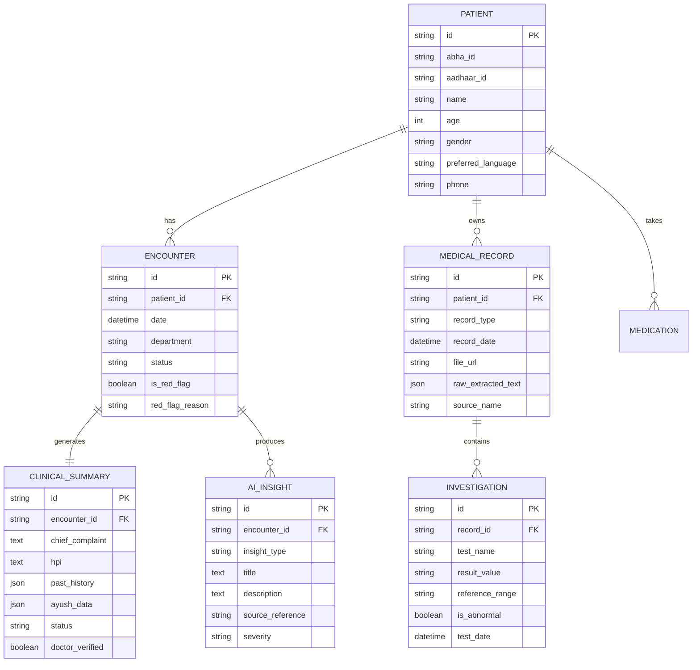

# SWASTLOK — Implementation Plan & System Blueprint
**Team Synaptix | Smart India Hackathon 2026 | Problem Statement 26047**

---

## 1. Executive Summary & Core Philosophy

**SWASTLOK** transforms high-volume hospital Outpatient Departments (OPDs) by moving the time-consuming administrative and clinical data gathering upstream, before the patient steps into the doctor's consultation room.

### Core Guiding Principle
> **"The AI is NOT the doctor."**
> AI Collects, Extracts, Structures, Summarizes, and Highlights. **The Doctor Checks, Verifies, and Decides.**

### The 4 Pillars of Clinical Context Intelligence (USP)
1. **What Changed?** — Delta from prior visits (symptom evolution, new/stopped meds, lab value trends).
2. **What Conflicts?** — Discrepancies between patient statements and previous prescriptions/records.
3. **What's Missing?** — Unreported critical diagnostic context for a chief complaint (e.g. chest pain radiation, breathing difficulty).
4. **Where Did It Come From?** — Source-backed citations linked to specific records/dates.

---

## 2. System Architecture & Tech Stack

```
                     ┌─────────────────────────────────────────────────┐
                     │              PATIENT ACCESS CHANNELS            │
                     │   Kiosk UI  |  Mobile View  |  Web Portal       │
                     └────────────────────────┬────────────────────────┘
                                              │
                                              ▼
                     ┌─────────────────────────────────────────────────┐
                     │       FRONTEND (React + Vite + TypeScript)      │
                     │  - Kiosk Intake Flow (Voice/Text, Lang, OTP)    │
                     │  - Document Camera Scan & Document Check        │
                     │  - Consult with AI & Adaptive Questioning       │
                     │  - AYUSH / Ayurveda Intake Flow                 │
                     │  - Doctor Clinical Dashboard & "Ask My Records" │
                     └────────────────────────┬────────────────────────┘
                                              │ REST API / WebSocket
                                              ▼
                     ┌─────────────────────────────────────────────────┐
                     │          BACKEND (Python + FastAPI)             │
                     │  - Auth & Mock ABHA/Aadhaar OTP + Consent       │
                     │  - Document Pipeline (OCR + Gemini Vision)      │
                     │  - Clinical Intelligence Engine (Gemini 2.5/Flash)
                     │  - 4-Pillar Analyzer (Delta, Conflicts, RedFlag)│
                     │  - Ask My Records Semantic RAG Service          │
                     └──────────────┬──────────────────┬───────────────┘
                                    │                  │
                     ┌──────────────▼──────────┐ ┌─────▼───────────────┐
                     │  DATABASE & STORAGE     │ │ AI / OCR / VOICE    │
                     │  - SQLite / PostgreSQL  │ │ - Gemini API        │
                     │  - Local / S3 Storage   │ │ - Tesseract/Vision  │
                     │  - Sample Preloaded Data│ │ - WebSpeech/AI4Bharat
                     └─────────────────────────┘ └─────────────────────┘
```

### Technology Breakdown
- **Frontend**: React 18 + Vite + TypeScript + Lucide Icons + Tailwind CSS / Modern Glassmorphic Clinical Design System.
- **Backend**: FastAPI (Python 3.11+) with async endpoints, Pydantic schemas, and structured clinical output parsing.
- **Database**: SQLite (Zero-config local dev with full relational schema) / PostgreSQL-ready via SQLAlchemy ORM.
- **AI / LLM Integration**: Google Gemini API for clinical document parsing, adaptive questioning, conflict detection, red-flag analysis, and source-attributed Q&A ("Ask My Records").
- **Voice & Multilingual**: Web Speech API + AI4Bharat speech synthesis/recognition abstraction layer (Hindi, Regional/Tamil/Telugu/Marathi/Bengali, English).

---

## 3. End-to-End User Journeys

### A. Patient Kiosk Journey (Authoritative Workflow)
1. **Language Selection**: Regional / Hindi / English (Large accessible touch targets).
2. **Interaction Mode**: Voice vs. Text / Touch.
3. **Identity Verification**: ABHA / Aadhaar ID input $\rightarrow$ Mock OTP $\rightarrow$ Consent Capture.
4. **Patient Home (3 Parallel Paths)**:
   - **Path 1: Upload (Camera / File)** $\rightarrow$ Live preview / alignment guide $\rightarrow$ OCR/Vision text extraction $\rightarrow$ Document Check (Correct $\rightarrow$ Confirm / Incorrect $\rightarrow$ Re-upload loop).
   - **Path 2: Consult with AI** $\rightarrow$ Present problem $\rightarrow$ Dynamic follow-up questions $\rightarrow$ Real-time Red-Flag check $\rightarrow$ Structured intake history.
   - **Path 3: Extract** $\rightarrow$ Immediate retrieval of existing records & AI summary without new inputs.
5. **Reconvergence**: Shared Clinical Case Object (Patient Info + Medical Records + AI Insights).
6. **Outputs**:
   - Patient: View / Print summary slip with token.
   - Doctor: Instant sync to Doctor Portal.

### B. Doctor Dashboard & Decision Journey
1. **OPD Queue & Triage**: Patient queue with priority flags (Red-Flag alerts highlighted in high-visibility badges).
2. **Unified Case View**:
   - **CURRENT**: Chief complaint, HPI, present symptoms, red-flags.
   - **HISTORY**: Past medical, surgical, family, personal, and AYUSH markers.
   - **MEDICATIONS**: Active medicines, dosage, adherence conflicts, allergy warnings.
   - **RECORDS**: Prescriptions, lab reports with abnormal value highlighting (e.g. HbA1c 8.4% [4-5.6%]), discharge summaries.
   - **TIMELINE**: Chronological clinical progression.
3. **Ask My Records (Interactive Clinical Assistant)**:
   - Doctor natural language query (e.g., *"What was the patient's HbA1c and lipid profile last visit?"*).
   - Instant response with verbatim source snippets and date tags.
4. **Doctor Verification & Decision**:
   - Inline edit, accept, reject, or verify tags for each AI-generated section.
   - Doctor enters final diagnosis, Rx prescription, lab orders, and follow-up date.
   - Final save to clinical record.

---

## 4. Database Schema & Entities



---

## 5. Implementation Phases (Step-by-Step)

### Phase 1: Project Skeleton & Foundation Setup
- Setup FastAPI backend with CORS, Pydantic schemas, and API routers.
- Setup React + Vite + TypeScript frontend with unified state management and navigation.
- Configure mock patient profiles (e.g., Ramesh Kumar - Diabetic OPD, Priya Sharma - Cardiac follow-up with conflict, AYUSH case).

### Phase 2: Kiosk Patient Intake Flow (Happy Path)
- Language picker (Regional, Hindi, English) & Voice/Touch toggle.
- Simulated ABHA/Aadhaar OTP entry & digital consent agreement.
- Patient Home 3-card hub: **Upload Records**, **Consult with AI**, **Extract Summary**.
- Upload module: Document camera/drag-and-drop, OCR extraction preview, and verification loop.
- Consult with AI: Conversational intake, adaptive clinical follow-up prompts, red-flag triage detection, and AYUSH questions toggle.

### Phase 3: AI Intelligence Engine & 4-Pillar Analysis
- Gemini API integration with structured prompt schemas.
- Clinical Delta (What Changed?), Conflict Detector (What Conflicts?), Missing Info Detector (What's Missing?).
- Source Linker linking extracted medical entities to source records and dates.
- Abnormal lab range detector (auto-flagging out-of-range values).

### Phase 4: Doctor Workspace & Ask My Records
- OPD Doctor Dashboard with live queue and red-flag triage badges.
- Tabbed Clinical Case view (Current, History, Medications, Records, Timeline).
- Clinical Context Intelligence Panel showing the 4 Pillars clearly.
- "Ask My Records" conversational query bar with clickable source tags.
- Review / Edit / Accept / Reject / Verify controls & Final Consultation Decision / Rx form.

### Phase 5: Polish, Audio/Visual Demos & Mock Data Richness
- Web Speech / Voice synthesis simulation for Hindi and English.
- Pre-populated realistic patient scenarios ready for live hackathon demonstration.
- UI styling polish: Clean clinical glassmorphic design, high contrast kiosk mode, and print-ready summary receipt.

---

## 6. User Review & Discussion Points

> [!IMPORTANT]
> **Key Architectural Decisions to Confirm:**
> 1. **Project Layout**: We can build this as a clean, cohesive Monorepo in `/Users/aditya/Documents/SwasthyaLok` with:
>    - `backend/`: FastAPI application, AI engine, SQLite database, OCR utilities.
>    - `frontend/`: React + Vite + TypeScript application with route switching between `/kiosk` (Patient intake) and `/doctor` (Doctor Workspace).
> 2. **AI API Key**: We will leverage the Gemini API for LLM processing, clinical document parsing, and natural language QA.
> 3. **Demo Readiness**: We will include pre-configured realistic Indian OPD patient cases to demonstrate:
>    - Case A: Patient with Type 2 Diabetes & Hypertension showing **What Changed** and **Abnormal Labs**.
>    - Case B: Cardiac chest pain with **Red Flag Alert** and **Dosage Conflict** (500mg prescribed vs 1000mg reported).
>    - Case C: Patient with Chronic joint pain opting for **AYUSH History Mode**.
